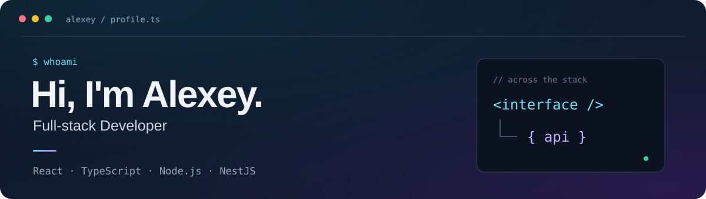

<div align="center">
  
  <br />
  <br />
  <a href="https://www.linkedin.com/in/alexey-yamkin-845060280/">
    
  </a>
</div>

---

```ts
const alexey = {
  role: "Full-stack Developer",
  frontend: ["React", "TypeScript", "JavaScript"],
  backend: ["Node.js", "NestJS"],
  database: "PostgreSQL",
  alsoWorkedWith: ["C#", ".NET"],
  outsideWork: ["Side projects", "Technical reading"],
};
```

### What I do

I develop web applications across the stack: React interfaces on the frontend and Node.js / NestJS APIs on the backend.

TypeScript is my primary language for connecting both sides. I also build personal projects to experiment with ideas and deepen my understanding of the tools I use.

### ⚡ Stack

<p>
  &nbsp;&nbsp;
  &nbsp;&nbsp;
  &nbsp;&nbsp;
  &nbsp;&nbsp;
  &nbsp;&nbsp;
  &nbsp;&nbsp;
</p>

### 🥋 Codewars

[](https://www.codewars.com/users/yamkin_a)

---

<div align="center">
  <b>Have something to discuss?</b><br />
  <a href="https://www.linkedin.com/in/alexey-yamkin-845060280/">Let's connect on LinkedIn ↗</a>
</div>
